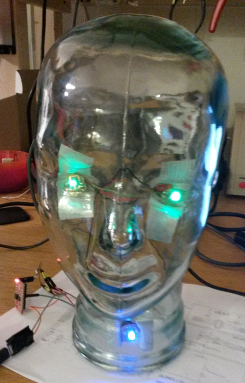

# LedHead

A simple library for controlling a total of 3 LEDs (2 for the eyes and 1 for the status) via the Adafruit's NeoPixel library.



##### Example

See [simple example with ESP](https://github.com/ringbuchblock/LedHead/tree/master/examples/simple_with_esp) for whole example.

```arduino

LedHead head;
int curColor = 0;

[...]

void rotateEyeColor() {
  std::vector<uint32_t> colors = {LedHead::YELLOW, LedHead::BLUE, LedHead::VIOLET};
  head.updateEyeColor(colors[curColor]);
  curColor = curColor + 1;
  if (curColor >= colors.size()) {
    curColor = 0;
  }  
}

void setup() {
  [...]
}

void loop() {
  if (noWifi()) {
    head.updateStatusLed(LedHead::RED);
  } else {
    head.updateStatusLed(LedHead::GREEN);
  }

  rotateEyeColor();

  delay(SEC_1);
  head.removeStatusColor();
  delay(SEC_1);
}
```
